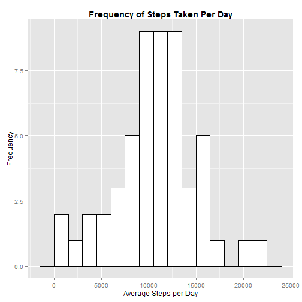
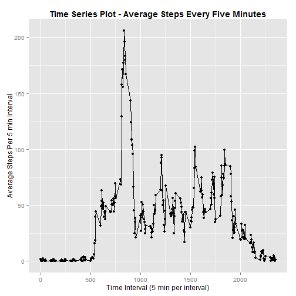
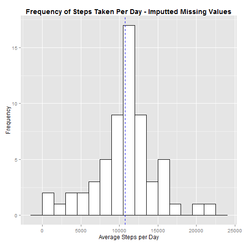
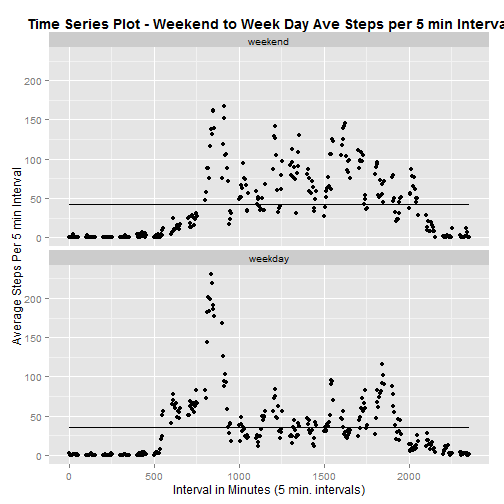

### INTRODUCTION

It is now possible to collect a large amount of data about personal movement using activity monitoring devices such as a Fitbit, Nike Fuelband, or Jawbone Up. These type of devices are part of the "quantified self" movement - a group of enthusiasts who take measurements about themselves regularly to improve their health, to find patterns in their behavior, or because they are tech geeks. But these data remain under-utilized both because the raw data are hard to obtain and there is a lack of statistical methods and software for processing and interpreting the data.

This study makes use of data from a personal activity monitoring device. This device collects data at 5 minute intervals through out the day. The data consists of two months of data from an anonymous individual collected during the months of October and November, 2012 and include the number of steps taken in 5 minute intervals each day.

### DATA
The Data used in this study was downloaded from the course site for Coursera - Reproducible Research through JHU at
<https://d396qusza40orc.cloudfront.net/repdata%2Fdata%2Factivity.zip>.

The dataset is stored in a comma-separated-value (CSV) file and there are a total of 17,568 observations in the dataset.


#### The original variables included in the dataset used by this study include:

**Steps**: Number of steps taking in a 5-minute interval (missing values are coded as NA)

**Date**: The date on which the measurement was taken in YYYY-MM-DD format

**Interval**: Identifier for the 5-minute interval in which measurement was taken

### ANALYSIS


####1 - Loading Dataset (.csv)


```r
MasterActivityData <- read.csv("activity.csv")
```

####2 - Determining the mean total number of steps taken per day.

+ Remove the missing values in the dataset.

```r
cols <- c("steps", "date", "interval")
CompleteActivityData <- MasterActivityData[!rowSums(is.na(MasterActivityData[cols])), 
    ]
```
+ Calculate the total number of steps taken per day

```r
StepDayTotals <- data.frame(CompleteActivityData %>% group_by(date) %>% summarise(TotalSteps = sum(steps)))
```

+ Results Showing Total Steps Taken Per Day are as follows:


```r
tab <- xtable(StepDayTotals,align = c("c","c","c"),label=NULL )
print(tab, type="html", include.rownames = FALSE)
```

<!-- html table generated in R 3.1.3 by xtable 1.7-4 package -->
<!-- Fri Apr 17 23:27:10 2015 -->
<table border=1>
<tr> <th> date </th> <th> TotalSteps </th>  </tr>
  <tr> <td align="center"> 2012-10-02 </td> <td align="center"> 126 </td> </tr>
  <tr> <td align="center"> 2012-10-03 </td> <td align="center"> 11352 </td> </tr>
  <tr> <td align="center"> 2012-10-04 </td> <td align="center"> 12116 </td> </tr>
  <tr> <td align="center"> 2012-10-05 </td> <td align="center"> 13294 </td> </tr>
  <tr> <td align="center"> 2012-10-06 </td> <td align="center"> 15420 </td> </tr>
  <tr> <td align="center"> 2012-10-07 </td> <td align="center"> 11015 </td> </tr>
  <tr> <td align="center"> 2012-10-09 </td> <td align="center"> 12811 </td> </tr>
  <tr> <td align="center"> 2012-10-10 </td> <td align="center"> 9900 </td> </tr>
  <tr> <td align="center"> 2012-10-11 </td> <td align="center"> 10304 </td> </tr>
  <tr> <td align="center"> 2012-10-12 </td> <td align="center"> 17382 </td> </tr>
  <tr> <td align="center"> 2012-10-13 </td> <td align="center"> 12426 </td> </tr>
  <tr> <td align="center"> 2012-10-14 </td> <td align="center"> 15098 </td> </tr>
  <tr> <td align="center"> 2012-10-15 </td> <td align="center"> 10139 </td> </tr>
  <tr> <td align="center"> 2012-10-16 </td> <td align="center"> 15084 </td> </tr>
  <tr> <td align="center"> 2012-10-17 </td> <td align="center"> 13452 </td> </tr>
  <tr> <td align="center"> 2012-10-18 </td> <td align="center"> 10056 </td> </tr>
  <tr> <td align="center"> 2012-10-19 </td> <td align="center"> 11829 </td> </tr>
  <tr> <td align="center"> 2012-10-20 </td> <td align="center"> 10395 </td> </tr>
  <tr> <td align="center"> 2012-10-21 </td> <td align="center"> 8821 </td> </tr>
  <tr> <td align="center"> 2012-10-22 </td> <td align="center"> 13460 </td> </tr>
  <tr> <td align="center"> 2012-10-23 </td> <td align="center"> 8918 </td> </tr>
  <tr> <td align="center"> 2012-10-24 </td> <td align="center"> 8355 </td> </tr>
  <tr> <td align="center"> 2012-10-25 </td> <td align="center"> 2492 </td> </tr>
  <tr> <td align="center"> 2012-10-26 </td> <td align="center"> 6778 </td> </tr>
  <tr> <td align="center"> 2012-10-27 </td> <td align="center"> 10119 </td> </tr>
  <tr> <td align="center"> 2012-10-28 </td> <td align="center"> 11458 </td> </tr>
  <tr> <td align="center"> 2012-10-29 </td> <td align="center"> 5018 </td> </tr>
  <tr> <td align="center"> 2012-10-30 </td> <td align="center"> 9819 </td> </tr>
  <tr> <td align="center"> 2012-10-31 </td> <td align="center"> 15414 </td> </tr>
  <tr> <td align="center"> 2012-11-02 </td> <td align="center"> 10600 </td> </tr>
  <tr> <td align="center"> 2012-11-03 </td> <td align="center"> 10571 </td> </tr>
  <tr> <td align="center"> 2012-11-05 </td> <td align="center"> 10439 </td> </tr>
  <tr> <td align="center"> 2012-11-06 </td> <td align="center"> 8334 </td> </tr>
  <tr> <td align="center"> 2012-11-07 </td> <td align="center"> 12883 </td> </tr>
  <tr> <td align="center"> 2012-11-08 </td> <td align="center"> 3219 </td> </tr>
  <tr> <td align="center"> 2012-11-11 </td> <td align="center"> 12608 </td> </tr>
  <tr> <td align="center"> 2012-11-12 </td> <td align="center"> 10765 </td> </tr>
  <tr> <td align="center"> 2012-11-13 </td> <td align="center"> 7336 </td> </tr>
  <tr> <td align="center"> 2012-11-15 </td> <td align="center">  41 </td> </tr>
  <tr> <td align="center"> 2012-11-16 </td> <td align="center"> 5441 </td> </tr>
  <tr> <td align="center"> 2012-11-17 </td> <td align="center"> 14339 </td> </tr>
  <tr> <td align="center"> 2012-11-18 </td> <td align="center"> 15110 </td> </tr>
  <tr> <td align="center"> 2012-11-19 </td> <td align="center"> 8841 </td> </tr>
  <tr> <td align="center"> 2012-11-20 </td> <td align="center"> 4472 </td> </tr>
  <tr> <td align="center"> 2012-11-21 </td> <td align="center"> 12787 </td> </tr>
  <tr> <td align="center"> 2012-11-22 </td> <td align="center"> 20427 </td> </tr>
  <tr> <td align="center"> 2012-11-23 </td> <td align="center"> 21194 </td> </tr>
  <tr> <td align="center"> 2012-11-24 </td> <td align="center"> 14478 </td> </tr>
  <tr> <td align="center"> 2012-11-25 </td> <td align="center"> 11834 </td> </tr>
  <tr> <td align="center"> 2012-11-26 </td> <td align="center"> 11162 </td> </tr>
  <tr> <td align="center"> 2012-11-27 </td> <td align="center"> 13646 </td> </tr>
  <tr> <td align="center"> 2012-11-28 </td> <td align="center"> 10183 </td> </tr>
  <tr> <td align="center"> 2012-11-29 </td> <td align="center"> 7047 </td> </tr>
   </table>

+ Histogram of the total number of Steps taken each day


```r
TotNumStepsHist <- ggplot(StepDayTotals, aes(x=TotalSteps)) + 
                  geom_histogram(
                              binwidth=1500,
                              colour="black", 
                              fill="white") +
                  xlab("Average Steps per Day") + ylab("Frequency") +
                  geom_vline(aes(xintercept=mean(TotalSteps)),
                             color = "red", linetype="dashed", Size = 3) + 
                  geom_vline(aes(xintercept=median(TotalSteps)),
                             color = "blue", linetype="dashed", Size = 2) +
                  ggtitle("Frequency of Steps Taken Per Day") + theme(plot.title = element_text(lineheight = .8, face = "bold"))
```
 

+ Calculate and report the mean and median of the total number of steps taken per day

```r
StepDayMeanMedian = median(StepDayTotals$TotalSteps)
StepDayMeanMedian
```

```
## [1] 10765
```

```r
StepDayMeanMean = mean(StepDayTotals$TotalSteps)
StepDayMeanMean
```

```
## [1] 10766.19
```


####3 - Determining the average daily activity pattern.

+Time series plot of the 5-minute interval (x-axis) and the average number of steps taken, averaged across all days (y-axis)

```r
StepIntervalMean <- data.frame(CompleteActivityData %>%
                  group_by(interval) %>%
                  summarise(AverageSteps = mean(steps)))

# Basic line graph with points
TotNumStepsRunChart <- ggplot(data=StepIntervalMean, aes(x=interval, y=AverageSteps)) +
                        geom_line() +
                        geom_point() +
                        xlab("Time Interval (5 min per interval)") + ylab("Average Steps Per 5 min Interval") +
                        ggtitle("Time Series Plot - Average Steps Every Five Minutes") + theme(plot.title = element_text(lineheight = .8, face = "bold"))
TotNumStepsRunChart
```

 

+ Which 5-minute interval, on average across all the days in the dataset, contains the maximum number of steps?


```r
MaxStepsByInt <- max(StepIntervalMean$AverageSteps)

MaxInterval <- tail(StepIntervalMean %>%
                              group_by(AverageSteps) %>%
                              slice(which.min(interval)),1)

MaxInterval <- as.numeric(MaxInterval[1,1])

MaxInterval
```

```
## [1] 835
```

```r
MaxStepsByInt
```

```
## [1] 206.1698
```

####4 - Imputing missing values

*There are a number of days/intervals where there are missing values which may introduce bias into some calculations or summaries of the data.*

+ Calculate and report the total number of missing values in the dataset (i.e. the total number of rows with NAs)


```r
MasterDataRowNums <- nrow(MasterActivityData)
CleanDataRowNums <- nrow(CompleteActivityData)
MissingRows <- MasterDataRowNums - CleanDataRowNums
MissingRows
```

```
## [1] 2304
```

+ The Mean for each five minute interval will be used to fill in all of the missing values in the dataset. 

+ A new dataset that is equal to the original dataset but with the missing data filled in.

```r
ImputtedActivityData <- MasterActivityData

#Create Hash table:
IntMeanHash <- StepIntervalMean
row.names(IntMeanHash)=IntMeanHash$interval

#Determine Length of Imputted Activity Data Frame
DataMaxRows <- NROW(ImputtedActivityData)      

#Cycle Through List and Replace NA in Steps Column with Mean from hash table IntMeanHash[KEY,2]:
for (x in (1:DataMaxRows)){
      if(is.na(ImputtedActivityData$steps[x])==TRUE){
            CurrInt <- as.character(ImputtedActivityData$interval[x])
            ImputtedActivityData[x,1] <- IntMeanHash[(CurrInt),2]   
      }
      
}
```


+ Histogram of the total number of steps taken each day 


```r
# Histogram overlaid with kernel density curve

ImputtedStepDayTotals <- data.frame(ImputtedActivityData %>%
                  group_by(date) %>%
                  summarise(TotalSteps = sum(steps)))


ImputtedTotNumStepsHist <- ggplot(ImputtedStepDayTotals, aes(x=TotalSteps)) + 
                  geom_histogram(
                              binwidth=1500,
                              colour="black", 
                              fill="white") +
                  xlab("Average Steps per Day") + ylab("Frequency") +
                  geom_vline(aes(xintercept=mean(TotalSteps)),
                             color = "red", linetype="dashed", Size = 3) + 
                  geom_vline(aes(xintercept=median(TotalSteps)),
                             color = "blue", linetype="dashed", Size = 2) +
                  ggtitle("Frequency of Steps Taken Per Day - Imputted Missing Values") + 
                              theme(plot.title = element_text(lineheight = .8, face = "bold"))
ImputtedTotNumStepsHist
```

 


+ Calculate and report the mean and median total number of steps taken per day. 


```r
ImputtedStepDayMeanMedian = median(ImputtedStepDayTotals$TotalSteps)
```

```
[1] 10766.19
```


```r
ImputtedStepDayMeanMean = mean(ImputtedStepDayTotals$TotalSteps)
```


```
[1] 10766.19
```

+ **Conclusion:** Do these values differ from the estimates from the first part of the assignment? What is the impact of imputing missing data on the estimates of the total daily number of steps?

> #####**The values are different as their respective frequencies will increase as illustrated in the historgram.  This potentially skews the data if the missing data does not follow the same distribution.  This would result if the actual values in the interval differ than the mean of the intervals from the included data.  This strategy 'cleans' the distribution in the histogram, but this may not reflect the reality of the missing data.**

####5 - Are there differences in activity patterns between weekdays and weekends?

*Dataset used with the filled-in missing values.*

+ Create a new factor variable in the dataset with two levels - "weekday" and "weekend" indicating whether a given date is a weekday or weekend day.


```r
#Make Copy of DF
DOWImputActData <- ImputtedActivityData

# Convert date column to proper date class
DOWImputActData$dates <- as.Date(as.character(DOWImputActData$date))

# Create Column with Day of the Week
DOWImputActData$WkDay <- weekdays(DOWImputActData$dates)

# Determine if wkDay is Weekend or Weekday and create a factor column - DaysOfWeek
weekdays1 <- c('Monday', 'Tuesday', 'Wednesday', 'Thursday', 'Friday')
DOWImputActData$DaysOfWeek <-  factor((DOWImputActData$WkDay %in% weekdays1)+1L,
      levels=1:2, labels=c('weekend', 'weekday'))
```


+ Make a panel plot containing a time series plot (i.e. type = "l") of the 5-minute interval (x-axis) and the average number of steps taken, averaged across all weekday days or weekend days (y-axis).

```r
StepIntMeanWkDay <- data.frame(DOWImputActData %>%
                  group_by(DaysOfWeek,interval) %>%
                  summarise(AverageSteps = mean(steps)))

# Basic line graph with points
TotNumStepsRunChartWkDay <- ggplot(data=StepIntMeanWkDay, aes(x=interval, y=AverageSteps,group = DaysOfWeek)) +
                        facet_wrap( ~ DaysOfWeek, ncol = 1) +
                        geom_line(stat = "hline", yintercept = "mean") +
                        geom_point() +
                        xlab("Interval in Minutes (5 min. intervals)") + ylab("Average Steps Per 5 min Interval") +
                        ggtitle("Time Series Plot - Weekend to Week Day Ave Steps per 5 min Interval") + 
                        theme(plot.title = element_text(lineheight = .8, face = "bold"))
TotNumStepsRunChartWkDay
```

 


+ **Conclusion:** Is there a difference between Weekend and weekday patterns?

> #####**Overall, there appears to be more activity during the Weekend than the week day.**

